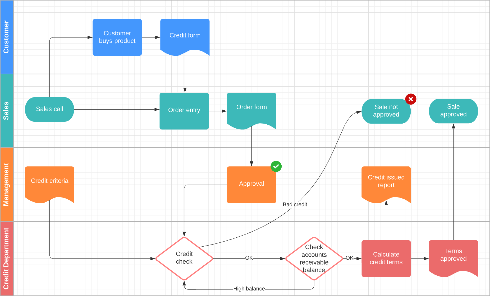
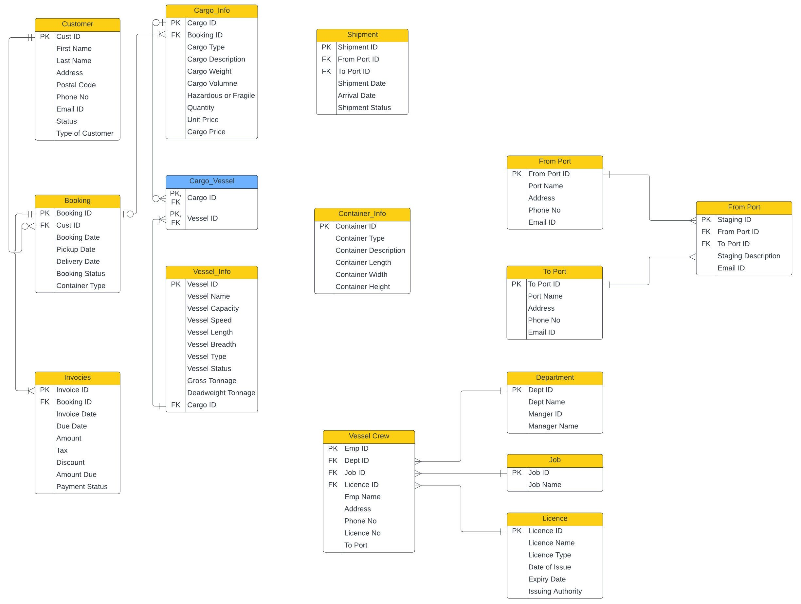
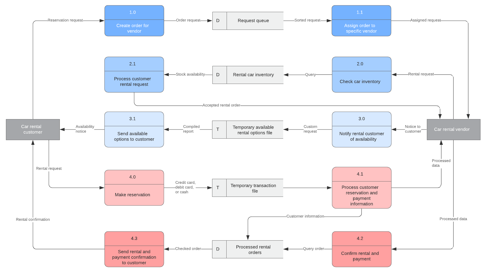

import TOCInline from '@theme/TOCInline';

Before you begin developing your solution, the below is an outline of some suggested methods and practices to assist in designing and building better applications.

<TOCInline toc={toc.filter((node) => node.level === 2 )} />

## 01. Requirements Gathering

This is a very critical step that helps shape the entire system or application being built. Expand below for details.

### Key Suggestions & Strategies

- If possible, ask to be included in all inception, design, and planning meetings or sessions.
  - This is essential to gaining a complete picture of the application you will be building.
  - Listen carefully and obtain all the requirements your external and/or internal customer has.
- While obtaining these project specifications, ask questions that help you understand your audience.
  - Examples:
    - Average user technical acumen
    - Average user knowledge of subject content
    - Current process average user task completion time
- Don't just understand the present requirements, learn the future plans, as well as how the past shaped the current request.
  - How does the audience achieve their goals presently, in the absence of this system?
  - In what ways is the current process flawed?
  - What are all the ways in which the new system or application will improve the current process?
  - What is the future vision of this solution?

## 02. System Diagram

### Key Suggestions & Strategies

- Outline a rough use case or flow diagram based upon the requirements. These diagrams help you map or layout the core operations and flow of your system.
  - It might be helpful to sketch your first draft using a large window or sliding glass door (chalk markers).
  - Afterwards, transfer your revised design(s) into a diagram program.
    - Examples:
      - [Lucidchart](https://www.lucidchart.com/) (they have a nice [tutorial](https://www.lucidchart.com/pages/what-is-a-flowchart-tutorial))
      - [Visio](https://www.microsoft.com/en-us/microsoft-365/visio)

### Sample Diagram

## 03. User Interface Mockup

When designing the application screens, it is natural to stumble upon missing items and gaps in requirements. Jot them down, as these are vital to the analysis process. Expand below for details.

### Key Suggestions & Strategies

- Attempt to draw or wireframe each screen within the system.
  - If you already have been provided UI designs, you may use those as a starting point.
    - However, it is important to go through this process to identify any issues or gaps.
  - Software diagram or design programs are ideal, as they save time when requirements are added or altered.
    - Examples:
      - [Mockplus](https://www.mockplus.com/)
      - [Figma](https://www.figma.com/)

## 04. Database Diagram

While paying close attention to the system requirements, it is important to design a database which supports the needs of each screen. You could view this as the heart of the system, where a poor design can greatly impact quality.

### Key Suggestions & Strategies

- Take a look at each screen within the application, and design tables or views to support each.
  - Review and trim any object or column redundancies, unless denormalization is ultimately necessary.
  - As mentioned previously, for the first pass consider sketching out the design with chalk markers and a large window, and then transition into a software program.
    - See above example programs.

### Sample Diagram

## 05. Data Flow Diagram

This diagram is useful for understanding and/or explaining where application data originates and moves throughout the interconnected internal and/or external systems. Expand below for details.

### Key Suggestions & Strategies

- Considering your system and database diagrams, map the flow of data throughout the application, in logical order.
  - This can be drafted on a whiteboard as part of a group exercise or individually using a software design tool.
    - See above example programs.

### Sample Diagram

## 06. Review & Revise

Upon reaching this stage, glaring problems or inconsistencies within the requirements are likely to have revealed themselves. Expand below for details.

### Key Suggestions & Strategies

- Collaborate with your team and go over your findings. This will help to solidify the end product.
  - If there are any requirement adjustments or additions, please version and update your designs to keep track.
    - This will help with understanding when key decisions were made, how often they change, and if you end up returning to a historical design.
