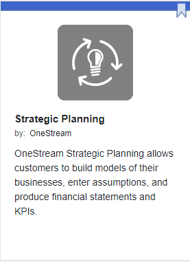

Listed below are the artifacts and requirements needed to launch a solution on OneStream’s [Solution Exchange](https://solutionexchange.onestream.com/).

| Artifact  | Artifact
type
  | Description  | Requirements  | Notes / Examples  |
|---|---|---|---|---|
| Solution Code Package  | Code  | The code package that a customer downloads and installs from the Solution Exchange  | <ul><li>Must be saved as a .zip file</li><li>Naming convention must be: XXX_PVX.X.X_SVXXX_PackageContents (ex: OSP_PV7.4.0_SV100_PackageContents)</li></ul>  |   |
| Release Notes  | Documentation  | Release Notes inform the customer of the features and bugs for a given release  | <ul><li>Must follow the OneStream documentation standards</li><li>Naming convention must be: XXX_PVX.X.X_SVXXX_ReleaseNotes (ex: OSP_PV7.4.0_SV100_ReleaseNotes)</li><li>Two file formats: .docx and pdf</li></ul>  | Optional for Private Preview  |
| User Guide / Instructions  | Documentation  | A solution manual  | <ul><li>Must follow the OneStream documentation standards</li><li>Naming convention must be: XXX_PVX.X.X_SVXXX_Instructions (ex: OSP_PV7.4.0_SV100_Instructions)</li><li>Two file formats: .docx and pdf</li></ul>  | Optional for Private Preview  |
| Overview  | Documentation  | A detailed summary describing the solution  | <ul><li>Must follow the specific template to be sized correctly on the Solution page</li><li>Naming convention must be: XXX_Overview (ex: OSP_Overview)</li><li>Two file formats: .docx and pdf</li></ul>  |   |
| Description  | Text  | A high-level summary describing the solution presented in the cards displayed on the Solution Exchange pages.  | <ul><li>Must be less than 200 characters</li></ul>  | Example:   |
| Keywords  | Text  | Up to ten keywords can be added to expand search capabilities for solutions  | <ul><li>Maximum ten keywords.</li><li>The match logic is exact. You can use two words, but those two words would need to both be entered to return a result. For example, adding Journal Entry will return results only when the two words are entered in the search exactly as “Journal Entry”. In this example, it is recommended that Journal Entry, Journal and Entry are entered as three separate keywords. Words can be separated by a hyphen.</li></ul>  |   |
| Solution Screenshots  | Images  | Solution screenshots are the four thumbnails that show the solution UI.   | <ul><li>Up to four screenshots can be presented. Three if a video file is also available.</li><li>Must be sized at 1900x900</li><li>Must be in PNG file format</li><li>Naming convention must be: XXX_Screenshot1 thru 4 (ex: ADM_Screenshot1)</li></ul>  |   |
| Solution Videos  | Video  | Overview video describing or marketing the solution.  | <ul><li>Only 1 video file will be supported per solution</li><li>The maximum video file size is 7 MB</li><li>The minimum video resolution is 1080p (1920x1080)</li><li>The video format is mp4</li><li>The file name must be XXX_Video (with XXX being the Solution acronym)</li><li>For a solution to be published a minimum of one solution screenshot must be included regardless of the video file present</li></ul>  | <ul><li>If there are four screenshots available in the solution folder then the video replaces Screenshot4</li><li>If the video file exists Application Database solution folder then it is presented in the UI as long as it meets the file requirements</li></ul>  |
| Solution icon  | Icons  | Solution icons represent the solution and are displayed in the solution tiles and on the solution details page.  | <ul><li>The file must be a PNG format</li><li>Naming convention must be: Image_XXX (ex: Image_ADM)</li></ul>  |   |
| Security Group members  | Name and Email  | If solution release is part of a Early Access programs then members need to be added to the security group.   | <ul><li>Full name and email</li><li>Must have Solution Exchange access</li></ul>  |   |
