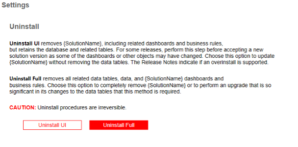

## Removing a Solution

Solutions in OneStream can significantly enhance your development experience by adding value via extensibility. However, there are several reasons why you might want to uninstall a solution. Compatibility issues are one factor, as certain solutions may conflict with updates to OneStream, leading to errors or unexpected behavior. Additionally, different applications might require different sets of solutions, so uninstalling unnecessary ones can help keep your development environment clean and focused. Lastly, regularly reviewing and uninstalling unused or outdated solutions can help maintain the security of your development environment. By periodically managing your solutions, you can ensure that OneStream remains efficient and tailored to your specific needs.

## How to Uninstall

You will want to have a settings page that has descriptions of Uninstall full, Uninstall UI, as well as buttons that a user can select for both options. If your solution does not have database tables, then you may only want to have one button just for Uninstall UI. Here’s what an end user would do to complete the process:

1. Click **Application** > **Solution’s Settings Page** > **Uninstall**
2. There are two uninstall options:

  - **Uninstall UI** removes the solution, including related dashboards and business rules but leaves the database and related tables in place. For some releases, this step should be performed before accepting any new version of the solution since some of the dashboards or other objects may have been modified.
  - **Uninstall Full** removes all the related data tables, all data, the solution dashboards, and business rules. Choose this option to completely remove the solution or to perform an upgrade that significantly changes the data tables.

:::caution

Uninstall procedures are irreversible.

:::

Here’s an example of how an uninstall dashboard would look from your settings page.



## Behind the Scenes: Uninstall Routine

When you uninstall a solution, OneStream runs several methods behind the scenes to ensure the solution is completely removed. These methods are executed based on which uninstall type was selected to ensure that all components of the solution are properly uninstalled. Here are the methods that are called during the Uninstall Routine:

### DeleteWorkspace()

Deleting a workspace will delete all nested maintenance units, dashboard groups, components, data adapters, parameters, files, and assemblies.

```csharp
private static bool DeleteWorkspace(SessionInfo si)
{
    // Delete the workspace associated with this solution
    Guid workspaceId = Guid.Empty;
    // Get the workspace to delete
    workspaceId = BRApi.Dashboards.Workspaces.GetWorkspaceIDFromName(si, false, "{SolutionName}");
    if (!workspaceId.Equals(Guid.Empty))
        // Delete workspace and all child items
        BRApi.Dashboards.Workspaces.DeleteWorkspace(si, false, workspaceId, true);
    return true;
}
```

### DeleteProfile()

Deleting a profile will remove the solution’s UI from OnePlace.

```csharp
private static bool DeleteProfile(SessionInfo si, DashboardExtenderArgs args)
{
    {
        // Delete Solution Dashboard Profile
        using DbConnInfo dbConnApp = BRApi.Database.CreateApplicationDbConnInfo(si);
        using DbConnInfo dbConnFW = BRApi.Database.CreateFrameworkDbConnInfo(si);
        DashboardProfile dashProfile = null;
        dashProfile = EngineDashboardProfiles.GetProfile(dbConnApp, "{SolutionName}");
        if (dashProfile != null)
        {
            SecurityHelperWcf.ValidateDelete(dbConnFW, dbConnApp, DashboardHelperWcf.GetRoleType(true), dashProfile, throwOnError: true);
            EngineDashboardProfiles.DeleteProfile(dbConnApp, dashProfile.UniqueID);
        }
        return true;
    }
}
```

### DropSolutionTables()

Dropping solution tables will drop all the Solution’s related database tables. This requires a `DROP TABLE` SQL script which will be described in the next section.

```csharp
private static bool DropSolutionTables(SessionInfo si, DashboardExtenderArgs args)
{
    // Open the DDL script used to create the custom tables required for this solution
    if (BRApi.Security.Authorization.IsUserInAdminGroup(si))
    {
        // Get the SQL from the TableDrop file in the dashboard
        string setupFileName = "tableDrop.txt";
        DashboardFileResource fileResource = BRApi.Dashboards.FileResources.GetFileResource(si, false,
        args.PrimaryDashboard.WorkspaceID, setupFileName);
        if (fileResource == null)
        {
            returnMessage.AppendLine("Table Drop File (" + setupFileName + ") is missing or invalid.");
            return false;
        }
        else
        {
            // Define string to hold SQL table drop script
            string sqlScript = Encoding.UTF8.GetString(fileResource.FileBytes);
            // Create connection to application database
            using DbConnInfo dbConnApp = BRApi.Database.CreateApplicationDbConnInfo(si);
            try
            {
                // Drop the dashboard Table(s) from the defined script
                BRApi.Database.ExecuteActionQuery(dbConnApp, sqlScript, false, true);

                return true;
            }
            catch
            {
                return false;
            }
        }
    }
    else
        return false;
}
```

### UninstallSolution()

When called this method will uninstall the UI, Business Rules, and drop all the Solution’s related database tables. It calls a combination of the previous 3 methods based on the uninstall type. For example, if a user selects Uninstall UI (uninstall type does not equal “Full”), then only the DeleteProfile and DeleteWorkspace methods are invoked.

```csharp

```
